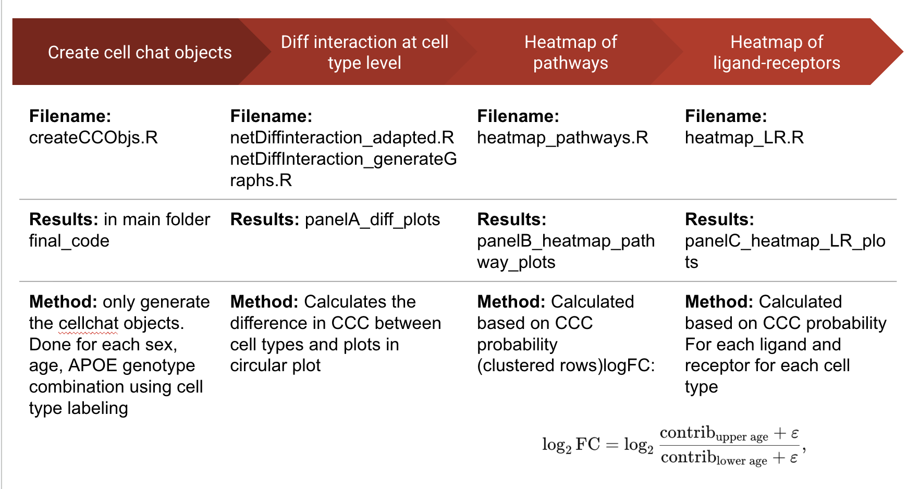

# CellChat Age-Contrast Analyses
Author: Carlota Pereda Serras
Last Edited: 10/17/2025

Scripts and precomputed CellChat objects to compute pathway- and LR-level age contrasts
across sex (F/M) and APOE genotype (E33/E44).

## Contents
- `createCCObjs.R` — build CellChat objects (DB v2) by sex/age/genotype.
- `netDiffInteraction_generateGraphs.R` — differential network visuals (Panel A).
- `heatmap_pathways.R` — pathway-level log2FC matrices (Panel B).
- `heatmap_LR.R` — GABA-A/B LR log2FC matrices for inhibitory neurons (Panel C).
- `netDiffinteraction_adapted.R` — adapted plotting function used by Panel A.

## Running
Use `Rscript <script>.R` from this directory. Scripts log to corresponding `panel*/...*.log`.

## Data
`.rds` objects are tracked via Git LFS.

## Methods 

### Construction of Cell–Cell Communication (CCC) Objects with CellChat v2 ###
We inferred cell–cell communication networks using CellChat (R) with the updated CellChatDB v2 (mouse). A Seurat object (Emouse) was loaded and converted to a normalized expression matrix (RNA assay, data slot) and metadata table. Cells annotated as remove or Choroid Plexus were excluded. For each combination of sex (Male, Female), age (06Mo, 12Mo, 18Mo), and APOE genotype (E33, E44), we subset the data (meta$sex/age/genotype) and instantiated a CellChat object with group.by = "cell_type_identity". We assigned the mouse ligand–receptor reference (CellChatDB.mouse), performed standard preprocessing (subsetData), and detected overexpressed genes and interactions (identifyOverExpressedGenes, identifyOverExpressedInteractions). Communication probabilities were computed with computeCommunProb, low-support edges were removed (filterCommunication(min.cells = 10)), and pathway-level probabilities were derived with computeCommunProbPathway, followed by network aggregation (aggregateNet). For each condition, the resulting CellChat object and its interaction table (subsetCommunication) were saved to disk as CC_DBv2_<Sex>_<Age>_<Genotype>.rds. 

We generated comparative network visualizations of ligand–receptor communication using CellChat (R package) from precomputed CellChat objects (.rds) corresponding to mouse  stratified by sex (Female, Male), age (06, 12, 18 months), and APOE genotype (E33, E44). All steps were executed in R from the project working directory (final_code).
Data loading and bookkeeping
CellChat objects were discovered in the working directory by matching the pattern CC_DBv2_*.rds. Filenames encode experimental factors (e.g., CC_DBv2_Female_06Mo_E33.rds). For reproducible labeling, the script derives short object names of the form cellchat.F06E33, cellchat.M18E44, etc., by parsing sex (F/M), age (06/12/18), and genotype (E33/E44) from the filename. Each object is read with readRDS() and normalized to the current CellChat schema using updateCellChat().
Cohort merges for longitudinal comparison
To enable within-sex, within-genotype, across-age comparisons, CellChat objects were merged into four longitudinal cohorts using mergeCellChat(add.names=…):
  Female E33 (FE3): 06Mo, 12Mo, 18Mo
  Male E33 (ME3): 06Mo, 12Mo, 18Mo
  Female E44 (FE4): 06Mo, 12Mo, 18Mo
  Male E44 (ME4): 06Mo, 12Mo, 18Mo
These merged objects retain per-group labels, allowing pairwise age comparisons by index within each cohort (e.g., 06 vs 12 months).

### Differential interaction computation and visualization (Panel A) ###
Differential networks were produced with a lightly adapted version of CellChat’s netVisual_diffInteraction() (here, netVisual_diffInteraction_adapted). For a given merged cohort and a pair of timepoints (e.g., comparison = c(1,2) for 06 vs 12 months), the method:
1. Extracts the directed, weighted adjacency matrices for the two groups from object@net[[i]][[measure]] with measure = "weight" (interaction strength).
2. Computes a signed differential matrix: Δ = W_group2 – W_group1, where positive edges indicate increased interaction strength in the later timepoint and negative edges indicate decreases.
3. Applies sparsification by keeping only the top 10% of edges by absolute magnitude (quantile threshold with top = 0.9), setting all others to zero; isolates may be removed if requested (disabled here).
4. Builds a directed graph (igraph) and renders it on a circular layout. Edges are colored red for increases and blue for decreases; alpha blending is used to encode edge opacity. Edge width encodes effect magnitude. With weight.scale = TRUE, widths are normalized to the cohort-specific maximum (if FALSE in a separate run, absolute magnitudes are used without normalization).

Vertex styling: nodes are shown in grey with constant size baseline. To improve legibility, canonical cell type names are abbreviated (e.g., “Excitatory.Neurons” → “Ex.Neu”, “Oligodendrocyte.Precursor” → “OPCs”), while preserving original names when not in the abbreviation map. The plot title reflects the chosen measure (“Differential interaction strength”).

### Pathway-level Cell–Cell Communication Comparison Across Age (Panel B) ###
To quantify condition-specific communication at the pathway level, we extracted ligand–receptor (LR) interactions from each CellChat object via subsetCommunication(). For each sample, we formed a long table containing: pathway identifier, interacting cell types (treated symmetrically as sources and targets), the CellChat interaction probability (prob), and a “group” label denoting the sample’s age (lower vs upper in a pairwise comparison). We then aggregated per-pathway, per-cell-type total communication strength by summing prob over all LR pairs involving that cell type (as source or target). This yields, for each sample, a pathway × cell-type table of “contribution” values.
Age effects were computed within each sex×genotype comparison by pairing the relevant samples (12 vs 06 months; 18 vs 12 months; 18 vs 06 months). For each pathway–cell-type pair we calculated a log2 fold-change of communication strength between the two ages with a small ε\varepsilonε to avoid division by zero. Optionally, a magnitude threshold can be applied to retain only pathway–cell-type pairs with ∣log⁡2FC∣. 
For downstream comparison, results across the four stratifications (Female E33, Female E44, Male E33, Male E44) were merged into a unified matrix with rows as pathways and columns as (condition × cell-type) combinations. Column ordering and categorical encodings (sex, genotype, cell-type levels) were fixed a priori to enable consistent alignment across analyses. Non-finite values were set to NA, and pathways with insufficient finite entries (≤1 column) were dropped to ensure stable distance computations in any subsequent clustering or statistical summaries.

### Ligand–Receptor (LR) Communication Comparison Across Age (Panel C) ###
Files were discovered in the working directory, loaded with readRDS(), and standardized using updateCellChat(). For each object, we extracted the ligand–receptor (LR) interaction table via subsetCommunication(), retaining the LR pair identifier (interaction_name_2), pathway label, sender and receiver cell types, the CellChat interaction probability (prob), and the corresponding pval. To quantify pathway-contextualized communication at the cell-type level for LR pairs, we constructed a long table in which each LR edge contributes to both its source and target cell types. For each condition, we then aggregated per-LR, per-cell-type contribution by summing prob across all instances involving that cell type (as sender or receiver) within the specified pathway.
Age effects were estimated within each sex×genotype stratifications by forming the three canonical age contrasts: 12 vs 06 months, 18 vs 12 months, and 18 vs 06 months. For every LR–cell-type pair (restricted here to the GABA-A and GABA-B pathways and Inhibitory Neurons), we computed a log2 fold-change of communication strength where a small ε\varepsilonε prevents division by zero. This produced one table per contrast with rows as LR pairs and columns encoding sex and genotype stratifications at the Inhibitory-Neuron level.
For cross-contrast comparability, we intersected LR row sets across the three contrasts and alphabetically ordered the common LR identifiers, reindexing each contrast’s matrix to that shared, ordered set. Missing or non-finite values were set to NA. To support consistent downstream scaling, we computed a global magnitude reference as the 98th percentile of the absolute log2FC values pooled across the three contrasts; this reference served solely to standardize magnitude interpretation and did not alter the underlying statistics.

